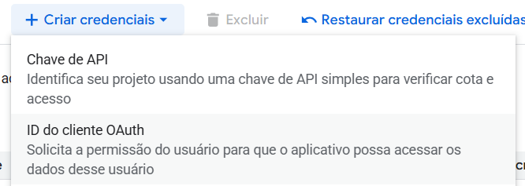
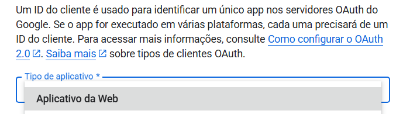

# 🦾 Assistente Inteligente de Agenda Médica

## 📄 Descrição do Projeto
Este projeto consiste em um **chatbot inteligente** para auxiliar **médicos** e **clínicas** em consultar rapidamente suas **agendas**. A aplicação utiliza Inteligência Artificial com LLM do **Google Gemini**, integrando-se diretamente ao **Google Calendar API** da conta fornecida para interpretar perguntas e recuperar os eventos correspondentes.

Para evitar o uso de dados reais, o sistema retorna dados fictícios de pacientes associados a cada evento, utilizando o **Random User Generator API** para a geração dessas informações.

## ⚙️ Funcionalidades
- 🤖 **Chat do Agente**:
  O chat principal do sistema, responsável por consultar a agenda médica e fornecer informações de forma intuitiva:
  - Listagem dos eventos do dia atual
  - Listagem dos eventos de amanhã
  - Listagem dos eventos da semana
  - Listagem dos eventos do mês atual
  - Permite perguntas em linguagem natural sobre compromissos
- 🧠 **Chat do Feedback**:
  Canal dedicado para coletar feedback em tempo real sobre as respostas do agente:
  - Ajuste do estilo das respostas (mais educado ou direto)
  - Melhoria contínua dos prompts do modelo com base no feedback do usuário

## 🗂️ Interface
A interface foi desenvolvida com **Streamlit** e possui **duas áreas** para comunicação com o assistente (Chat do Agente e Chat do Feedback).

[Veja o vídeo de demonstração do Chatbot](/assets/demo_chatbot_bluelephant.mp4)

## 🛠️ Tecnologias
- **Linguagem**: Python
- **LLM / Inteligência Artificial**:
  - Google Gemini API (google-genai) – classificação e interpretação de intenções do usuário
- **Integração com Google Calendar**:
  - google-api-python-client – acesso à API do Google Calendar 
  - google-auth e google-auth-oauthlib – autenticação OAuth 2.0
- **Armazenamento Vetorial**:
  - faiss-cpu – indexação e busca semântica de embeddings 
- **Interface do Usuário**:
  - Streamlit – interface web interativa para o chatbot
- **Configuração de Ambiente**:
  - python-dotenv – gerenciamento de variáveis de ambiente
- **Gerenciamento de Dependências**: pip (requirements.txt)
- **Requisições HTTP e Utilidades**:
  - requests – consumo de APIs externas 
  - pytz – manipulação de fusos horários 
  - regex – processamento avançado de texto 
  - numpy – suporte a operações numéricas

## ⚒️ Configuração

**Pré-requisitos**:

- Configuração da API do Google Calendar: É necessário criar suas próprias **credenciais** do Google Calendar.
  1. Clone o repositório do projeto (passo necessário para ter a pasta `services/`):
     ```bash
     git clone https://github.com/isinhah/bluelephant-medical-assistant
     cd bluelephant-medical-assistant
      ```
  2. Acesse o [Google Cloud Console](https://console.cloud.google.com/apis/credentials)
  3. Habilitar o *Google Calendar API* na seção `APIs e serviços ativados` do [Google Cloud Console](https://console.cloud.google.com/apis)
  4. Crie um OAuth 2.0 Client ID do tipo "Aplicativo da Web"  
     <br>
      
  5. Baixe o arquivo `credentials.json`
  6. Coloque o arquivo `credentials.json` na pasta `services` do projeto.


- Configuração da API do Google Gemini: É necessário criar sua própria API Key para acessar a LLM do Google Gemini.
  1. Crie um arquivo `.env` na **raiz** do projeto:
        ```bash
          touch .env
        ```
  2. Acesse o [AI Studio Google](https://aistudio.google.com/api-keys?hl=pt-br)
  3. Crie uma API Key
  4. Copie a API Key
  5. Cole a API Key dentro da variável GEMINI_API_KEY no arquivo `.env`:
        ```text
          GEMINI_API_KEY=sua_chave_aqui
        ```

## ⚒️ Instalação e Execução
Após ter seguido as etapas acima (Google Calendar + API Key do Gemini):

```bash
# 1 - Instale as dependências do projeto.
pip install -r requirements.txt

# 2 - Execute o script principal. Não use CTRL + C para copiar o link de autenticação.
python run_app.py

# 3 - Para encerrar a aplicação, pressione CTRL + C no terminal.
```

## 📦 Execução com Docker
> ⚠️ **Aviso**
>
> Esta aplicação utiliza OAuth 2.0 com o Google Calendar.  
> Na primeira execução, é necessária uma **autenticação interativa no navegador**.
>
> Esse fluxo **não funciona no Docker / Docker Compose**, pois o Google Auth precisa abrir um servidor local para **redirecionar** o **navegador** do usuário.
>
> A execução recomendada é **no ambiente local**.

## 💡 Exemplos de Uso
- Perguntas do Usuário
  - Quais consultas tenho hoje?
  - Quais consultas tenho amanhã?
  - Quais consultas tenho esta semana?
  - Quais consultas tenho este mês?

- Respostas do Chatbot
  ```text
  Encontrei estas consultas para você:
  
  Data: 15/12/2025
  Nome do evento: Consulta Cardiologia
  Tipo: consulta de rotina
  Horário: 00:00 às 23:59 (dia inteiro)
  Paciente: João da Silva
  Email do paciente: joaodasilva@example.com
  Telefone: (11) 99999-9999
  ```

## 🔌 APIs utilizadas

- 📆 **Google Calendar API**:
  - A aplicação integra-se diretamente com o Google Calendar da conta autenticada para **ler e organizar os eventos da agenda médica**.  
  - Apenas os endpoints básicos foram utilizados para **consultar eventos**.
  - [Documentação oficial](https://developers.google.com/workspace/calendar/api/guides/overview?hl=pt-br)

- 👨 **Random User Generator API**:
  - Utilizada para **gerar dados fictícios de pacientes** em cada evento, permitindo testes realistas sem expor informações pessoais.  
  - Essa API ajuda a popular o chatbot com **nomes, e-mails e telefones de teste**.  
  - [Site oficial](https://randomuser.me/)

## 🙋‍♀️ Autor
👩‍💻 Projeto desenvolvido por [Isabel Henrique](https://www.linkedin.com/in/isabel-henrique/)
